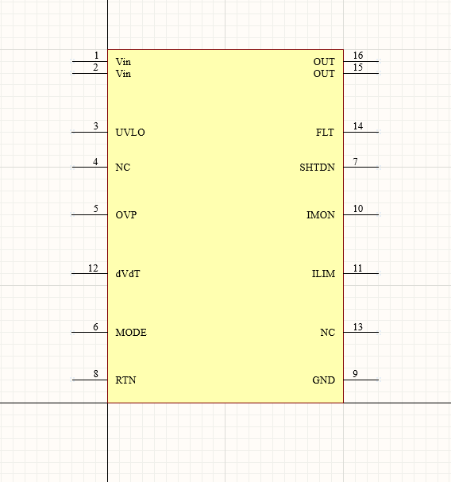
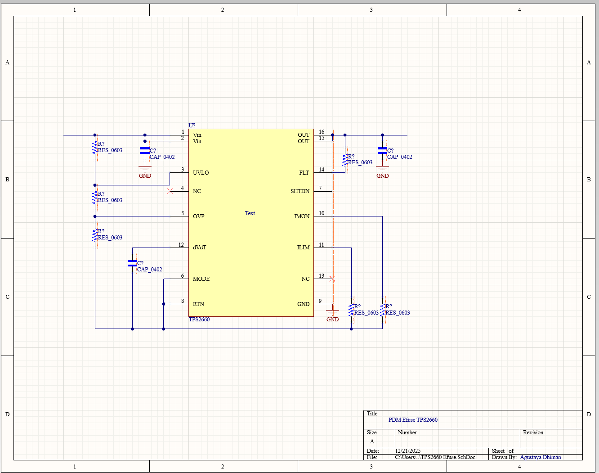
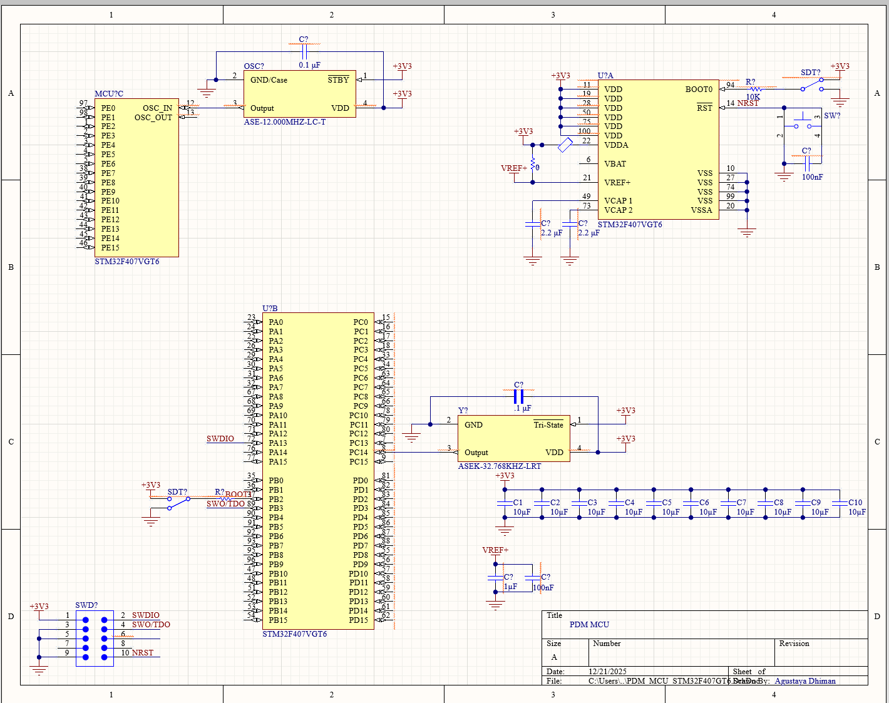

# SAE Formula Electric Power Distribution Module (PDM)

## Project intro and overview
The Power Distribution Module (PDM) is responsible for distributing LV power to downstream boards and monitoring current draw. It also monitors LV battery status and reports power system status to VCU and telemetry systems.

## System Overview
The PDM so far consists of 
- 9 TPS2660 effuses
- STM32F4 MCU
- Dedicated buck converter

In addition to this, several higher current effuses are being researched for future integration, currently looking at the MP5981GLU-P, TPS25990, or the TPS25983. Furthermore, a battery moniter circuit is also under development for future integration into the PDM.

## Schematic Breakdown

### TPS2660 Custom Symbol

A custom symbol was created based off of the manufacturer datasheet. This was done in order to provide superior readability compared to the symbol offerred in Altium.

### TPS2660 General Setup

This schematic defines the general wiring, and componenets needed for each of the 9 TPS2660 to be used. Specific values and setups will be made later in accordance to what is needed.

### STM32F4 Microcontroller Unit General Setup

The MCU schematic is currently in progress and so far includes core pin connections, timers, and some componenets. 

### Buck Converter

A dedicated buck converter steps down the LV voltage to 3.3V so that the MCU can safely operate.

## Tools and Skills Used
- All schematics have been created through Altium Designer.
- The MCU will be programmed using C or C++.

## Project Status
This project is currently ongoing, with completion expected around late February 2026.
